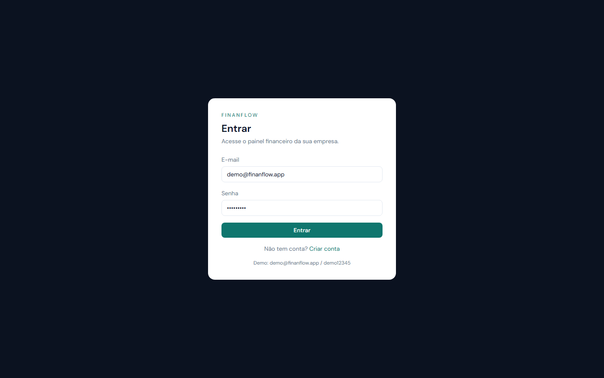
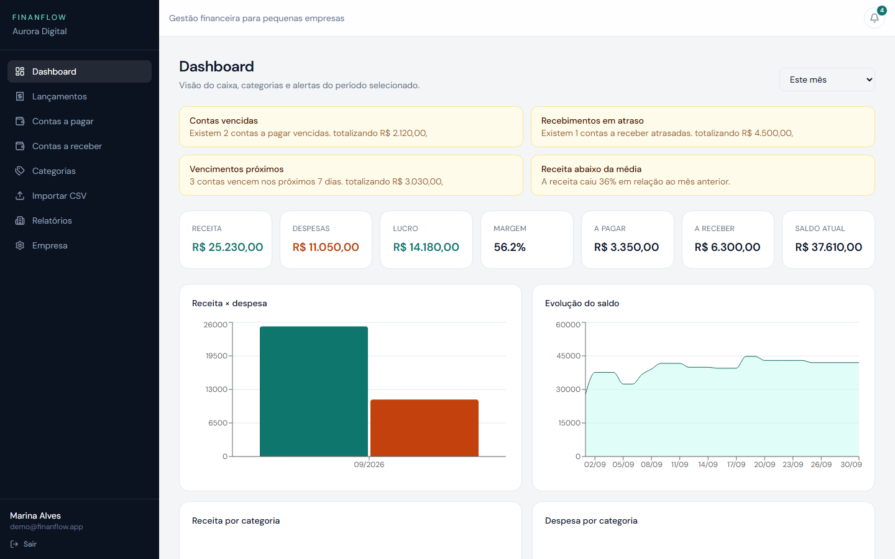
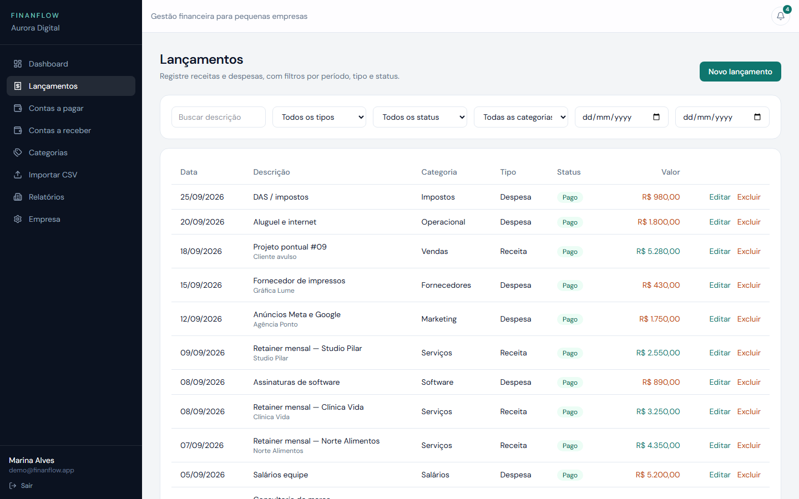
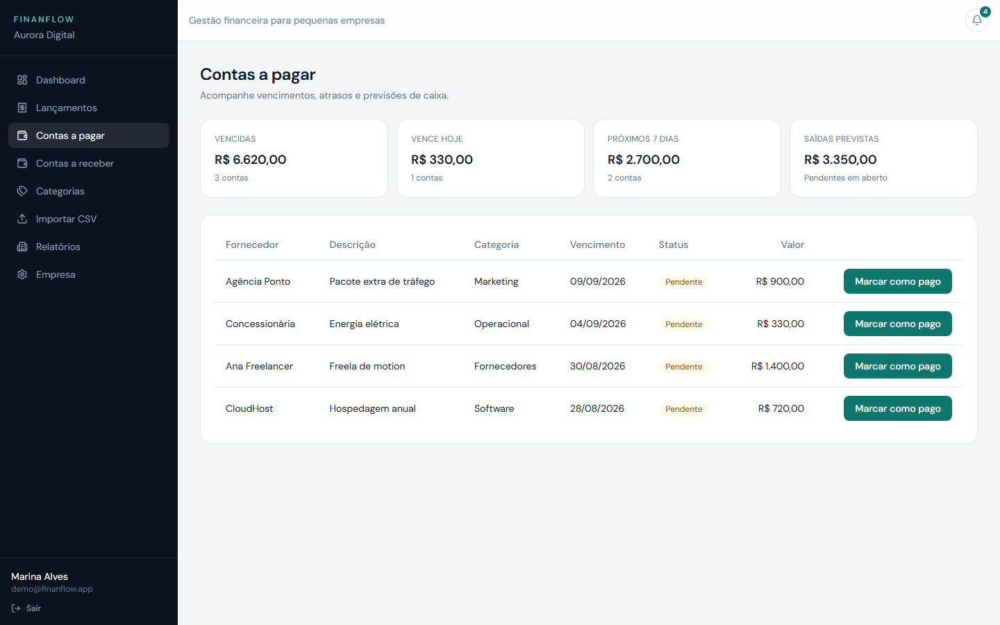
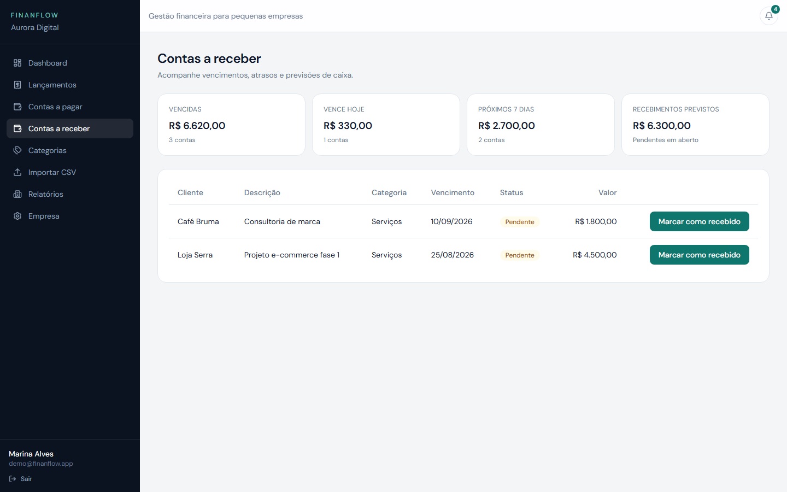
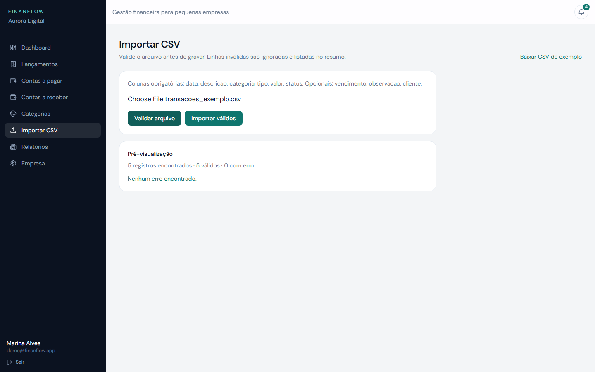
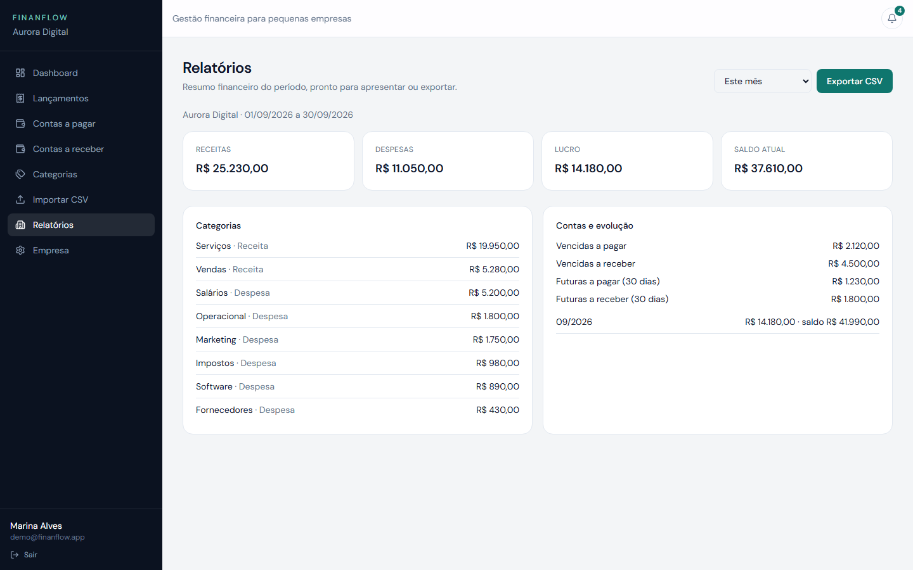
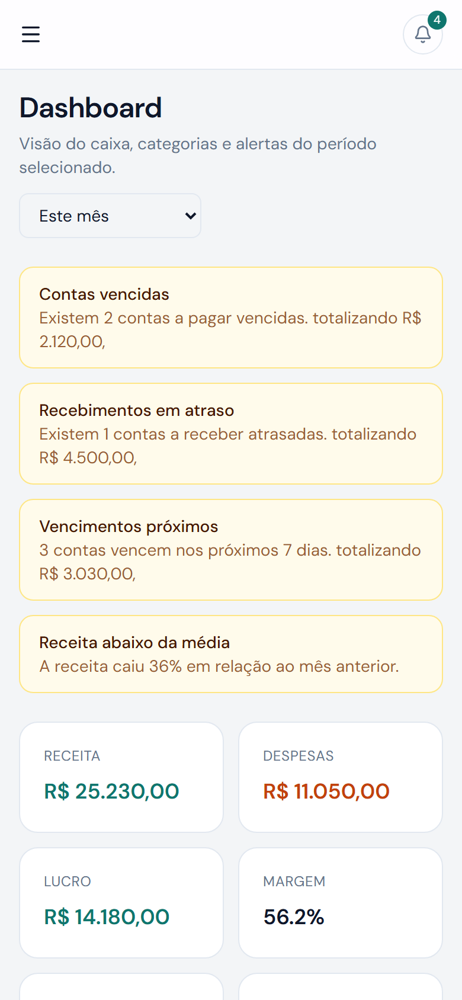
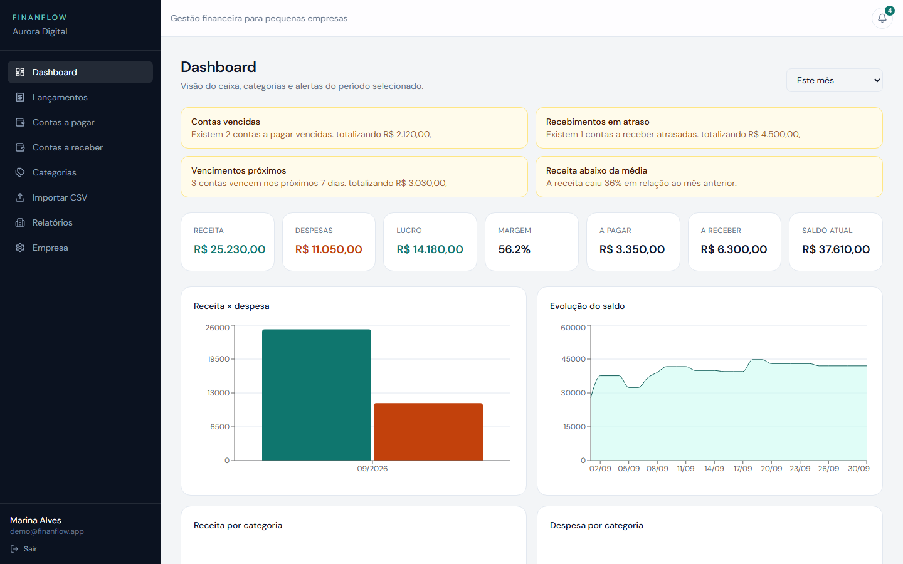

# FinanFlow

Plataforma web de gestão financeira para pequenas empresas. Case de portfólio: dashboard, lançamentos, contas a pagar e receber, importação de CSV com Pandas e alertas automáticos.

> Empresa de demonstração: **Aurora Digital**. Dados fictícios.

## O problema

Quem toca um negócio pequeno costuma acompanhar o caixa em planilha, extrato e mensagem. Falta um painel único para ver o que entrou, o que sai, o que vence e o que já atrasou — sem virar um sistema contábil.

## O que o sistema faz

- Login por empresa, com dados isolados entre contas
- Dashboard com indicadores, gráficos e alertas do período
- Lançamentos de receita e despesa, com filtros e busca
- Contas a pagar e a receber, com marcar como pago/recebido
- Categorias, relatórios e exportação em CSV
- Importação de planilha com validação linha a linha
- Rotina diária que aponta atrasos, vencimentos e variação de receita/despesa

## Preview

















## Vídeos da demonstração

Clique no print para abrir o vídeo do fluxo principal. Os outros dois estão no repositório.

[](docs/videos/01-login-dashboard.webm)

- [Login e dashboard](docs/videos/01-login-dashboard.webm) — acesso à conta demo, indicadores, período e alertas
- [Contas a pagar](docs/videos/02-contas-a-pagar.webm) — vencimentos e marcar como pago
- [Importação de CSV](docs/videos/03-importacao-csv.webm) — validação com Pandas e gravação dos registros válidos

## Stack

**Frontend:** React, Vite, TypeScript, Tailwind CSS, Recharts

**Backend:** Python, FastAPI, SQLAlchemy, Alembic, Pandas, APScheduler

**Banco:** PostgreSQL

**Infra:** Docker Compose

## Como rodar

```bash
cp .env.example .env
docker compose up --build
docker compose exec backend python scripts/seed.py
```

Abra [http://localhost:8080](http://localhost:8080).

### Conta demo

| | |
|---|---|
| E-mail | `demo@finanflow.app` |
| Senha | `demo12345` |
| Empresa | Aurora Digital |

Swagger da API: [http://localhost:8000/docs](http://localhost:8000/docs)

### Desenvolvimento sem Docker completo

Suba só o Postgres (`docker compose up db -d`) e rode API e frontend locais:

```bash
cd backend
python -m venv .venv
.venv\Scripts\activate
pip install -r requirements.txt
alembic upgrade head
python scripts/seed.py
uvicorn app.main:app --reload --port 8000
```

```bash
cd frontend
npm install
npm run dev
```

Frontend em [http://localhost:5173](http://localhost:5173).

## Arquitetura

```text
React SPA  →  FastAPI  →  Services (regras + Pandas)  →  PostgreSQL
                              ↑
                         APScheduler (08:00)
```

O frontend não calcula lucro, margem ou fluxo de caixa. A API devolve os agregados. Contas a pagar e a receber são lançamentos pendentes — não tabelas separadas.

## Importação de CSV

1. O arquivo é lido com Pandas
2. Colunas, datas, tipos, status e valores são validados
3. A tela mostra o preview (válidos e erros por linha)
4. Na confirmação, só o que passou entra no banco
5. Categoria nova é criada automaticamente

Colunas obrigatórias: `data,descricao,categoria,tipo,valor,status`

Exemplo em [`sample_data/transacoes_exemplo.csv`](sample_data/transacoes_exemplo.csv).

## Testes

```bash
cd backend
pytest
```

Cobre autenticação, isolamento entre empresas, lançamentos, cálculos e importação.

## Variáveis de ambiente

Copie `.env.example` para `.env`. Não versione o `.env` real.

| Variável | Uso |
|---|---|
| `SECRET_KEY` | Assinatura do JWT (use um valor longo) |
| `DATABASE_URL` | `postgresql+psycopg://...` |
| `CORS_ORIGINS` | Origens do frontend, separadas por vírgula |
| `VITE_API_URL` | URL da API no build. Vazio usa `/api` no mesmo origin |

## Deploy

Caminho simples: Neon (Postgres), Render (API com o Dockerfile do backend) e Cloudflare Pages (frontend). No Pages, `VITE_API_URL` aponta para a API.

## Melhorias futuras

- PDF do relatório
- Aviso por e-mail ou WhatsApp
- Mais de um usuário na mesma empresa
- Lançamentos recorrentes

## Licença

Uso para portfólio e demonstração. Sem dados reais de clientes.
